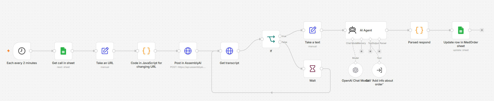
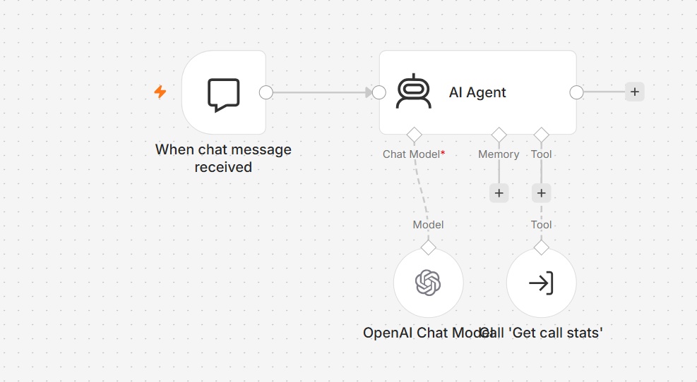

# MedOrder AI

AI-powered pharmaceutical call automation system built with n8n, OpenAI API, and AssemblyAI.

---

## Overview

MedOrder AI is an AI automation system designed for pharmaceutical warehouses and medical suppliers that process a high volume of medication orders.

The system automates:

- call processing
- speech-to-text transcription
- AI order analysis
- structured data extraction
- analytics and reporting

The main goal of the project is to reduce manual work, optimize business operations, and minimize operational costs.

---

## Problem

Traditional call-center workflows create several business problems:

- Delays in processing orders
- Human errors during data entry
- High operational costs
- Difficulties with analytics and reporting
- Loss of potential customers

---

## Solution

MedOrder AI fully automates the order processing pipeline using AI technologies.

The workflow:

- receives customer calls
- converts speech to text
- analyzes order information with AI
- extracts structured order data
- stores information in Google Sheets
- generates analytics automatically

---

## Technologies

- n8n
- OpenAI API
- AssemblyAI
- Google Sheets API
- HTTP Requests
- AI Agents
- JavaScript
- JSON

---

## Workflow Architecture

```text
Incoming Call
      ↓
Speech-to-Text (AssemblyAI)
      ↓
AI Processing (OpenAI)
      ↓
Structured Order Extraction
      ↓
Google Sheets Database
      ↓
Analytics & Reporting
```

---

## Business Value

### Before Automation (AS-IS)

- 5 call-center operators
- Slow order processing
- High operational costs
- Customer service delays

### After Automation (TO-BE)

- Automated order processing
- Faster call handling
- Reduced manual workload
- Staff optimization from 5 to 2 operators
- Cost reduction by 60%

---

## Key Results

### Efficiency

AI processes calls significantly faster than manual operators.

### Cost Reduction

Operational expenses reduced by 60%.

### Accuracy

Automated workflows minimize human errors.

### Scalability

Easy integration with CRM systems, AI agents, and additional automation workflows.

---

## Future Improvements

- CRM integration
- AI voice agents
- Real-time inventory synchronization
- Advanced analytics dashboard
- Multi-channel order processing

---

## Screenshots

### Workflow




## Author

Mariana Koval

Junior Fullstack Developer & AI Automation Engineer

- LinkedIn: https://linkedin.com/in/mariana-koval-fullstack-developer
- GitHub: https://github.com/Mariana331
